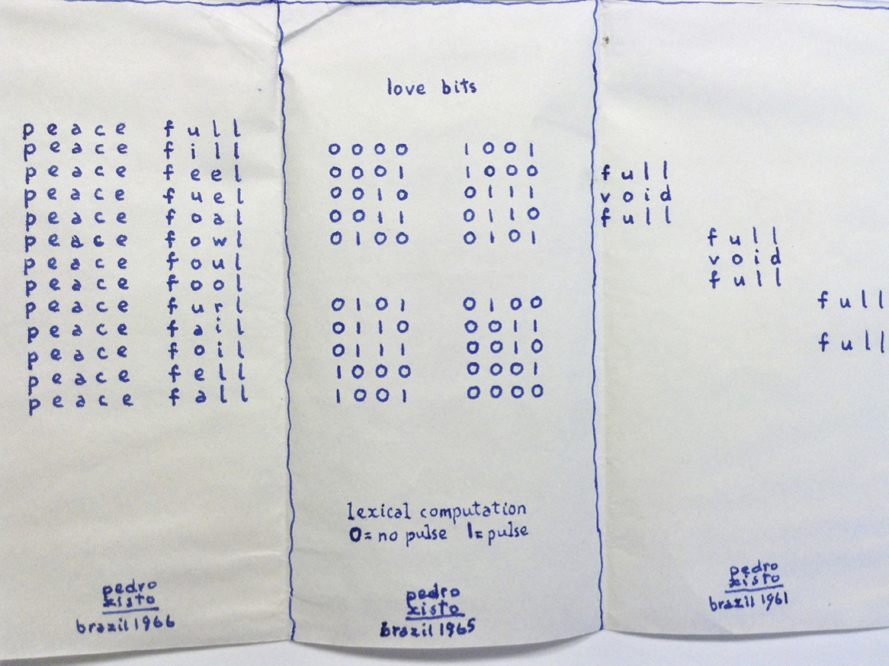

## Re Verse Engineering: Poems on the Turn. 
_Bronac Ferran_
 
 
 
Researching a series of text-related events and exhibitions relating to the 1950s and 1960s has led me to recognize that the emergence of computers, or computational thinking[11](#fn11)<a id="fnref11"> had strong parallels and interconnections with the form and content of concrete poetry works. The form of the concrete poem was open to inventiveness, pliability and malleability yet simultaneously encouraged intensive concentration by the viewer or listener. It allowed us to move in, contemplatively as well as to look out at the white spaces between words and around them. Revisiting these sometimes overlooked poetic constructs can offer a space for considering an idea of the pre-digital after years of exposure to digital visual overload.  If the idea of post-digital holds, then might not recognising the pre-digital also? This text begins to look back through the lens of interrelations between poetry and early computing. It interleaves some thoughts on discovering and inventing.

### 1. On Discovering
> A particular convention or attitude in art has a strict analogy to the phenomena of organic life. It grows old and decays. It has a definite period of life and must die. All the possible tunes get played on it and then it is exhausted; moreover its best period is its youngest. Take the case of the extraordinary efflorescence of verse in the Elizabethan period. All kinds of reasons have been given for this – the discovery of the new world and the rest of it. There is a much simpler one. A new medium had been given them to play with – namely blank verse. It was new and so it was easy to play new tunes on it’.[12](#fn12)<a id="fnref12">

### 2. On Inventing
John Cage spoke in 1972 of the influence his father, an inventor of submarines, had on him. He also recounted how Schönberg, his music teacher, when asked who was his best pupil had said – Cage, then added: ‘of course he’s not a composer but he’s an inventor – of genius’.[13](#fn13)<a id="fnref13"> Schönberg believed that there was no technique without invention and that it was closely aligned with inspiration, otherwise it was imitation. 

The etymological root of engineering, the Latin word _ingeniare_, means ingenious and clever thinking coming from within. Indeed much of the impact of engineering happens below the surface, at structural or sub-structural levels. We might think that poets are also subterranean diviners. But they can also affect perceptible surfaces.  In 1964, Brazilian poet Décio Pignatari wrote that ‘for me, poets are language designers’.[14](#fn14)<a id="fnref14"> He expressed this at a point when the skills of graphic and industrial designers, typographers and poets were crossing over, evident among networks of people in Brazil, Germany and UK in particular, resulting in the making of new types of poetry – variously called concrete, process based, visual, spatial or semiotic. Finding new ways to describe the movement itself occupied many pages and many manifestos. Linguistic inventiveness was at the heart of this development. In 1965, Haroldo de Campos coined the term typoetry[15](#fn15)<a id="fnref15"> to describe the work of one practitioner, Hansjörg Mayer whose skills with language, type and form helped fit this new jigsaw – a typoetical revolution? -  together. 

### 3. Poets and Revolutionaries
There are points in history when the runes and rules of poetry shift and seem to go head in hand with revolutionary turns. It is sometimes thought that many English poets, in the stormy period after the French revolution, turned their faces and their backs away from the emerging industrial revolution and took refuge in, clouds, daffodils, Gothic storms and wilderness. They did this. But the truth is a little more complex. When we look at William Blake’s depiction of Isaac Newton’s powers of calculation it helps to reinforce our belief that he was radically opposed to science. But though true on one level this image could not have been so precisely and accurately realized had Blake himself not understood a lot about calculation.  He knew inside out what he was drawing. Similarly, a little known fact is that Lord Byron was formally elected to the Royal Society, though only went there once. His friend Percy Bysshe Shelley was greatly influenced in his youth by James Lind, royal physician and close friend of James Watt who belonged to Erasmus Darwin’s Lunar Society. Samuel Taylor Coleridge, who an exemplary early inter-disciplinarian, declared that he wished to ‘warm his mind with universal science’ (Prescott, 2012) and was a close friend of Michael Faraday, inventor of electromagnetic induction.[16](#fn16)<a id="fnref16"> He “discovered’/was inspired to write the poem _Kubla Khan_, in an opium influenced dream-state. Ada Lovelace, mathematician daughter of Lord Byron, who called her Princess of Parallelograms, showed her innate poetry when she wrote of how she saw the Analytical Engine as: ‘a machine for weaving algebraic patterns just as the Jacquard loom weaves flowers and leaves’.[17](#fn17)<a id="fnref17">

*Manuscript poem by Pedro Xisto, a Brazilian poet which was enclosed in a letter sent to Stephen Bann in 1966.*

The discovery of electricity was also food for a Gothic imaginary. The enduring imaginative power of Mary Shelley’s Frankenstein reveals the capacity of the literary imagination to rapid prototype future fictions.

A remarkably prescient essay published in 1797, attributed to German idealistic poet Friedrich Hölderlin, expresses a poetic desire to ‘give wings to our slow physics which has been moving so laboriously by way of experimentation… Thus – when philosophy provides the ideas [and] experience the data we can finally achieve a physics on a large scale which I expect from future epochs. It does not seem that present physics can satisfy a creative spirit as ours is or should be’ [18](#fn18)<a id="fnref18">
In visionary poetry also from this period, Hölderlin began to fragment words and leave extended white spaces, which we might recognize as an important step towards the spatial poetics which Stéphane Mallarmé’s _Un Coup de Dés Jamais N’Abolira le Hasard_ brought fully to light in 1896. It has been recently argued that Mallarmé’s poem, was based on a numerological play with the number seven.[19](#fn19)<a id="fnref19">  It is a certainly a vital turning point between symbolism and serialism. Its conceptual abandonment of poetic control makes a leap through the gate out of the 19th century and into the 20th.

A small network of writers including T. E. Hulme and Ezra Pound banded together in Soho in London in 1909 with the shared aim of writing a new form of poetry appropriate to a new century. The outcome was Imagism which brought a new focus on precision of form and concision of statement and which drew, through Pound in particular, on Japanese and Chinese ideographic influences. Picture and language-making were beginning to coalesce and combine.   

### 4. Programming the Poem
Interconnections between concrete and visual poetry forms and what we now think of as early computer art were initiated for the first time by Professor Max Bense at Stuttgart Technische Hochschule in the late 1950s. His expertise in mathematics and philosophy infused the experimentation which his publishing, teaching and exhibition activities facilitated. His influence was enormous on the development of concrete poetry internationally. It was on the large Zusse mainframe computer at the Technischen Hochschule in Stuttgart that what is regarded as the first computer poem was created by Theo Lutz in 1959. It was through connections to Bense that in 1965 in Stuttgart Georg Nees and Frieder Nake (who had been a maths student at the Hochschule) had their (and the world’s) first exhibition of computer plotter drawings.

Mayer, the poet and typographer who had studied informally with Bense in the late 1950s, contributed significantly to the development of an ‘international style’ within concrete poetry design and typography, with his consistent use of lowercase and futura typeface which for a critical period in the mid-1960s many other poets adopted. His first typoems and experimental typographies date from the very early 1960s. From 1964-1968, through his imprint, edition hansjörg mayer, he published many early works revealing correspondences between concrete poems and early computations within the context of his three major concrete poetry portfolios as well as a series called _futura_. One of the contributors to the _futura_ series was the Imagist poet, Louis Zukofsky. Mayer also published a rarely seen portfolio of prints made with computers by Frieder Nake in 1967. This portfolio called _Matrizenmultiplikationen_ is currently on display at Tate Modern. Mayer’s unique expertise and virtuosity with print technologies of the time allowed for the casting of works in various experimental formats which stretched, fragmented and expanded the concept of the poem. He combined an interest in chance and randomness with a mathematically precise attention to use of graphic space, which makes his works now seem anticipatory of networked systems whilst holding a more modernist purity of form. He typeset several issues in the early-mid ‘60s of Bense and Walther’s booklet, _rot_, a seminal platform for disseminating and circulating possibilities of concrete and computational convergence.

The work of both Bense and Mayer was referenced in a special edition of the _Times Literary Supplement_ in 1964 focussing on literary avant-gardes internationally. Edited by John Willett and extremely wide-ranging in scope, it showed intersections and correspondences between concrete and visual poetry with ideas from semiotics and emerging information theory. Willett edited another special issue focussing on UK and US-based writers and poets which included work by dom Sylvester Houédard, a Benedictine monk who was particularly interested in connections between computational language and poetry. He was the first in England to give lectures about concrete poetry and links to machines. He recognized that the movement (the turns) which kinetic poetry offered were a further step into the post-authorial void which Mallarmé had first identified and which computers in potential offered a chance to take further.  His own works often called typestracts were usually produced on an Olivetti typewriter in the small cell in the Abbey where he lived in Gloucestershire. A prolific letter writer, he was often invited to provide introductory texts for concrete poetry festival catalogues which he wrote in characteristically hyper-textual, inventive language that looks prescient of today’s texting and twitter.  He sent typestracts out widely to friends and acquaintances. Prices are for these works are rising posthumously.  

Prompted by the TLS coverage of Bense and information aesthetics, Sylvester wrote a letter[20](#fn20)<a id="fnref20"> to Margaret Masterman who had founded the Computer Language Research Unit in Cambridge several years earlier which Houédard considered the nearest equivalent in the UK to Bense’s project in Stuttgart:[21](#fn21)<a id="fnref21">

> --- I find all this area still unsatisfactorily mapped in british philosophy----I mean---if language is THERE to use ok------but the need for new words is w / us all the time ----- they don’t come by analysis------we can take the words & nonwords quark and antiquark & use them and make means things abt elementary properties------but I’m thinking about a deeper problem (I think) abt the originating of language and communicating signs-------- or does one just have to depend on the given & enlarge it?

Masterman had studied philosophy with Wittgenstein and with colleagues in the CLRU made a pioneering contribution to experimentation within the then emerging field of natural and machine language processing. In his letter Sylvester also referred to the challenges of: ‘--- getting machines to write tolerable conceptual and semantic associations & language models &c.’ linking this to his experiments at the time in making in kinetic poetry with poets Kenelm Cox, John Furnival and Richard Loncraine:
  
> .---- our own contribution --- here in the Cotswolds (furnival loncraine cox myself) has been (….) towards the possibility (via kinetic poetry) of machine semiotic poems in which NO lexical key is provided any more than when nice/nasty/white/&c clouds passes across ?yr sky (have the glostershire group (‘gloop’) poets here produced art? Poems? Or a language?...or is it that the poet constructs the MACHINE --- ie the machine IS the poem? --- cf pierre albertbirot on the POET as the poem machine in grabinoulor).

Houédard was here referring to Pierre Albert-Birot, a friend of Guillaume Apollinaire whose calligrammes from earlier in the century were important influences on later visual poets. Albert-Birot’s lead printer had stayed up all night to typeset Apollinaire’s hand-drawing of Il Pleut into the form which we recognize today, first published in Albert-Birot’s journal SIC in 1916.[22](#fn22)<a id="fnref22">

### 5. ‘The difference between the concrete and the computer poet is’…
Fifty years after Apollinaire’s premature death, poetry became part of what is acknowledged by many to be the first major exhibition of computer art, organized at the ICA in London by Jasia Reichardt, in 1968. Exhibited works included _Computerised Haiku_ which Margaret Masterman made in collaboration with Robin McKinnon-Wood, who was a founder of another pioneering organisation called Systems Research Ltd.

In a text published a year earlier in the journal From _Theoria_ to Theory McKinnon-Wood and Masterman had given an extended account of their hypothesis and experiments:[23](#fn23)<a id="fnref23">

> (ii) Algorithms (mechanical tricks) can also be used to produce a fully computerized poem. For instance, in the output given immediately below the machine has been (a) only to chose words beginning with the letter ‘s’ and, (b) when there is a choice among ‘S’ words, to take the one whose second letter is nearest the end of the alphabet (and so recursively, if there is still a choice of words).
…
The fact that some of these algorithms of tricks produce quite good output highlights the known fact that traditional poetry also uses tricks of rhythm, rhyme and alliteration to allow words to combine more freely (because more mechanistically) than would be permitted by the stereotypy of prose.

> VII. The role of the poet in computer poetry
It will be evident from the above that the poet programming a computer must: (i) set up the frame, (ii) create the thesaurus, (iii) devise any mechanical tricks (e.g. rhyming) with which he may desire to operate. ….He can, of course, be vastly more sophisticated than we have in setting up and varying his frame (a sonnet, for instance, is a sophisticated frame).

But the ultimate creative act, for the computer poet, lies in writing the thesaurus.

They end with an amusing yet serious summary of differences between the concrete and the computer poet:

> From the above it would provisionally appear that, whereas part of the motivation of the genuine concrete poet is to stream-line his own mind, so as to make his poem into something as like an algorithmically produced machine output as possible, the computer-poet on the contrary, tends to use the machine to create a profusion of new, surprising and unforeseen combinations of words which, without its help, he would not have thought of.

### 6. Revealed in the turn

In 2012 I had the opportunity to curate an exhibition to coincide with the centenary of Alan Turing’s birthday, which I called _Poetry, Language, Code_. Among works included were several by Ernest Edmonds including concrete poems from 1967 and a print out of a computer programme he wrote using FORTRAN in 1968, juxtaposition of which demonstrated intriguing parallels and differences. Writing later about making ‘concrete poem collages’ Edmonds has described how his work evolved from making simple, constructive, rules based poems on a typewriter to a more complex set of works using code from around 1968: ‘the structure and the computation became all. The poetry was in the code’.[24](#fn24)<a id="fnref24">

The exhibition tried to reveal the important materiality of early code works and so included also a print out of POEM FOR SPASMO composed in 1969 by the late Alan Sutcliffe, one of the founders of the Computer Arts Society, using an ICL 1904. At the top of what looks like a programme written for a computer is printed in tiny lettering 

> WHEN YOU SEE THE MOON PLEASE SAY THIS POEM QUIETLY. 

His text for the _Visualise_ book concluded as follows: 

> over the years, I have moved from wanting to specify every detail of a work, to wanting to leave everything to a computer programme, often using random values to take decisions, so that I was distanced from the process of composition. I would have liked to have no pre-mediated decisions but there must be at least some part to the process, to decide what programme to write.[25](#fn25)<a id="fnref25">

### 7. A poetic conclusion

In the arts and humanities, design and engineering fields, we’re experiencing turn after turn. We’ve had the linguistic and the digital turns, and now the material and the spatial
But could there be one that would aggregate all the others into a potential revolution?  Perhaps we need a poetic turn.  It is not that difficult to argue for. Poets reverse engineer facts and rapid prototype future fictions.  They have often been associated with revolutionary movements because they need to attenuate language and so their work becomes meaningful - or should be -  at points of dynamic shift or transformation. Despite themselves, they have been in the revolutionary vanguard of our current interdisciplinary preoccupations, bringing STEAM to the narrow STEM. Of course their contributions can often be too early or too out there to be understood, sometimes even by themselves. I think a poet led turn would be nicely challenging. It can be about taking the can of worms and revelling in the escaping. 

Image caption/credit: 
2 images - choose 1 if there is limited space 
The first is one of the prints from the Frieder Nake matrixmultiplikation portfolio published by edition hansjörg mayer,1967  
the second is a manuscript poem by Pedro Xisto, a Brazilian poet which was enclosed in a letter sent to Stephen Bann in 1966.  

Note: 
If the definition isn't good enough I am not sure I can enhance the Xisto one but Hansjörg could do a better version of the Nake one as he has the portfolio in his studio in London and i could ask him to send another.

> The truth is that the eyes and the fingers the bare fingers are the two principal inlets to sound practical instruction. They are the chief sources of trustworthy knowledge in all the materials and operations which the engineer has to deal with. No look knowledge can avail for that purpose. The nature and properties of the materials must come in through the finger ends. Hence, I have no faith in young engineers who are addicted to wearing gloves. Gloves, especially kid gloves, are perfect non- conductors of technical knowledge.

> James Nasmyth, _Autobiography_ (1883)

___

<ol start="11">
<li id="fn11">Ernest Edmonds, “Moving Between Poetry and Code”, in <i>Visualise: MAKING ART IN CONTEXT</i>, ed Bronac Ferran (Anglia Ruskin University 2013) pp64-71.<a href="#fnref11">↩</a></li>
<li id="fn12">T. E. Hulme, “Romanticism and Classicism”, in <i>Speculations</i>, ed Herbert Read (New York: Harcourt, Brace 1924) pp121-122.<a href="#fnref12">↩</a></li>
<li id="fn13">John Cage, interview with Jeff Goldberg in <i>Transatlantic Review</i>, 55/56. Ed J.F. McCrindle (1972). pp103-110.<a href="#fnref13">↩</a></li>
<li id="fn14">Décio Pignatari, “The Concrete Poets of Brazil” in <i>Times Literary Supplement Any Advance? The Changing Guard 2</i>, ed John Willett (Times Publishing 1964) and downloadable at:
https://loriemersondotnet.files.wordpress.com/2011/10/astronautsofinnerspace.pdf (accessed 5.8.2016).<a href="#fnref14">↩</a></li>
<li id="fn15">Haroldo de Campos, contribution to catalogue of <i>TYPOETRY</i> exhibition of the work of Hansjörg Mayer, Studiengalerie, Stuttgart, ed Max Bense (1965).<a href="#fnref15">↩</a></li>
<li id="fn16">See http://journalofdigitalhumanities.org/1-2/an-electric-current-of-the-imagination-by-andrew-prescott/ (accessed 6.8.2016).<a href="#fnref16">↩</a></li>
<li id="fn17">Notes in Lovelace’s hand with her translation from the French of article on the Analytical Engine by Luigi Menabrea (1843). See http://www.computerhistory.org/babbage/adalovelace/ (accessed 5.8.2016).<a href="#fnref17">↩</a></li>
<li id="fn18">Friedrich Hölderlin, from The Oldest System-Program of German Idealism. http://ebooks.cambridge.org/chapter.jsf?bid=CBO9780511803734&cid=CBO9780511803734A013 (accessed 5.8.2016).<a href="#fnref18">↩</a></li>
<li id="fn19">"Quentin Mellassoux, “<i>The Number and the Siren: A Decipherment of Mallarmé’s Coup de Dés</i>”. Trans. Robin McKay. (Falmouth Urbanomic 2012).<a href="#fnref19">↩</a></li>
<li id="fn20">Dom Sylvester Houédard, “Poetry Theory & Poetry Theoria”, in THEORIA TO THEORY, Vol 1 First Quarter 1966 (The Epiphany Philosophers) pp6-9.<a href="#fnref20">↩</a></li>
<li id="fn21">Unpublished letter from dom Sylvester Houédard to Hansjörg Mayer, October 1965.(The Epiphany Philosophers) pp6-9.<a href="#fnref21">↩</a></li>
<li id="fn22">Il Pleut by Guillaume Apollinaire was typeset by M. Leve and first published in SIC (Son Idées Couleur) journal no 12, ed Pierre Albert-Birot (1916). <a href="#fnref22">↩</a></li>
<li id="fn23">Cambridge Language Research Unit, “<i>Computerized Haiku</i>”, in THEORIA TO THEORY, Vol. 1 Fourth Quarter, 1967 (The Epiphany Philosophers) pp378-382.<a href="#fnref23">↩</a></li>
<li id="fn24">Ernest Edmonds, “Moving Between Poetry and Code”, in <i>Visualise: MAKING ART IN CONTEXT</i>, ed Bronac Ferran (Anglia Ruskin University 2013) pp64-71. <a href="#fnref24">↩</a></li>
<li id="fn25">Alan Sutcliffe, “MAIN GROUNDS (anag, 5.2)” in Visualise: MAKING ART IN CONTEXT, ed Bronac Ferran (Anglia Ruskin University 2013) pp55-59.<a href="#fnref25">↩</a></li>
</ol>
