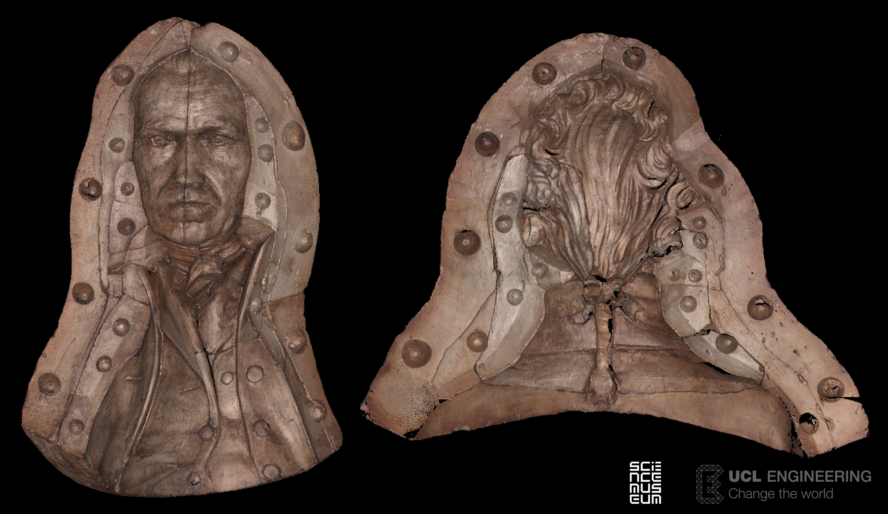

## James Watt - a VR encounter with the engineer 
_Dr Mona Hess_
 
 
 
Non-contact non-destructive 3D imaging methods and 3D printing were used to produce a physical replica of the original ‘negative’ plaster-cast form, for a unique artefact, a newly discovered portrait bust of the engineer James Watt. In a next step we use the 3D digital model to create a VR (Virtual reality) experience so that visitors can explore the 3D dataset in a stereo view in the round. In this immersive experience you will be up close and personal, and face to face, with the engineer James Watt.

Watt’s workshop is the legendary ‘magical retreat’ of engineer James Watt after his retirement, preserved as it was when he died in 1819. More than 8,000 fascinating objects left as they were in Watt’s lifetime. Amongst the objects in the workshop are twenty-three plaster-cast moulds, most of which had never been opened and were still bound with their original string. Two especially complex moulds contained portraits. One of the portrait moulds was a ca. 30 cm high bust of a man dating from 1807 (M.23/ Science Museum inventory), which stirred significant interest by the curators. Was it a portrait of James Watt himself? The bust was found inside the workshop around 1807 and a hint in a letter implies that it was recreated from a mould that may have been cast by Lucius Gahagan for Watt, but the written records were quite inconclusive; this theory needed to be confirmed by seeing the positive cast itself. This project follows a request in 2010 by Ben Russell, curator of Mechanical Engineering at the Science Museum with the final purpose was to integrate the replica into the new exhibition.

Historical forms of casting for reproduction were excluded as it was paramount for the conservation of the original to use a non-contact method that did not disturb the material and surface inside of the mould. The form was very complex, composed of four main pieces containing a total of twenty-nine separate sub-pieces. Cutting edge technology was used for non-contact reproduction of a plaster cast-  3D colour laser scanning with a sampling distance / resolution of 0.1mm. The digital 3D models of the four main negative components of the cast form were aligned and the surface normal direction was inverted to create a positive surface model. The result was a first image of the cast and was immediately recognized by the curator as a previously unseen portrait of James Watt. Further processing took the decision of the curator into account that the model should show the manufacturing process of the casting and that the joint lines of the single cast form should remain visible and elevated. 

In a subsequent step the full resolution 10.5 millions points was transferred into a high-resolution polygon mesh of 1.5 polygons for 3D printing. The surface was modeled to be a completely closed surface geometry without holes (e.g. watertight), especially around the shirt sleeves. An artificial cutting curve was introduced to form an even base and a bore hole on the back for mounting the bust was integrated.  

3D data acquisition of the negative cast form produced a high-resolution 3D virtual model as a point cloud which can be regarded as the digital equivalent of a conventional plaster cast mould. It also allows the experience in Virtual Reality in larger than life and immersive environment. Questions of material culture, of authenticity and quality of the real object versus the 3D digital reproduction are discussed intensely in the digital heritage community. 

The use of 3D printing allows of course limitless and identical reproductions. But if the commissioned 3D print is to be the definitive final object, the long-term conservation the 3D nylon print has a limit due to its known photo-instability. In consequence, future reproductions through 3D printing need to be examined and selected for longevity, since soon 3D replicas will become artefacts in their own right, just as Watt’s mould has become. 

This 3D print of Watts’ bust has been officially accessioned (number 2011.14 Science Museum). The new exhibit of the Watt’s workshop “James Watt and our world. The workshop, the man and the new industrial age” was mounted in the Energy Hall of the Science Museum accompanied by a case showing the existing portraits of James Watt alongside the newly discovered bust as 3D print in prominent position across from the steam engine and has exposure to the public. You can visit the Science Museum yourself to have a look.

The 3D imaging and 3D printing technology employed in this case study has produced a physical tangible model and a Virtual Reality experience of a previously unseen portrait bust of James Watt, one of the Industrial Revolution's greatest engineers.

Further reading about the project: Hess, M., & Robson, S. (2013). [Re-engineering Watt: A case study and best practice recommendations for 3D colour laser scans and 3D printing in museum artefact documentation](https://iris.ucl.ac.uk/iris/publication/407387/1). In, D. Saunders, M. Strlic, C. Kronenberg, K. Birholzer, N. Luxford (Eds.), Lasers in the Conservation of Artworks IX (pp. 154-162). London, UK: Archetype. (https://iris.ucl.ac.uk/iris/publication/407387/1)

[Download your app to see the VR James Watt for Google Cardboad](https://play.google.com/store/apps/developer?id=3DIMPact+at+UCL+CEGE)

Underlying dataset commissioned and copyright of the Science Museum, with kind permission to use for this project. VR & app development by 3DIMPact / UCL CEGE. Connect by Twitter: @Mona3Dimaging and @UCL_3DIMPact or #3DIMPact. Supported by the AHRC Digital Transformations Theme.

*Image: 3D coloured scan of the object, the negative cast form*
