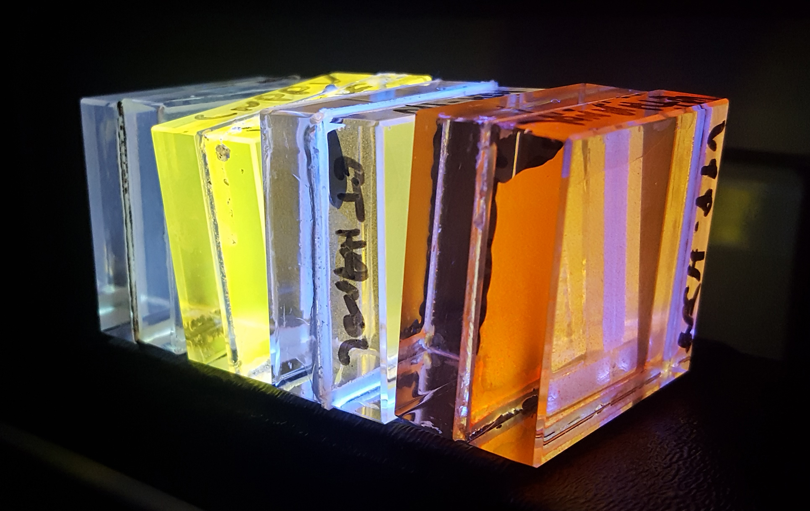
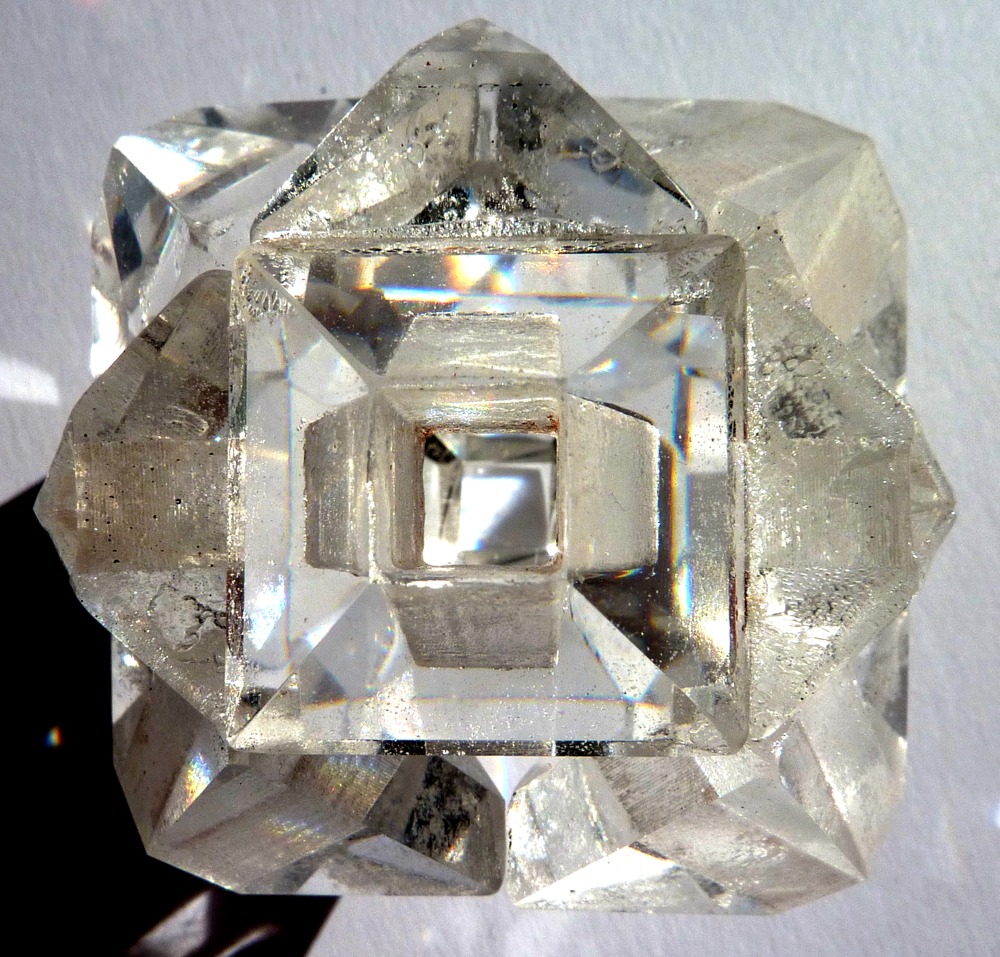

_Image1: Nanoparticles in optical glass, a technique refined with students during the Parallel Practices project at King’s College London_

## Hacking The Enlightenment – Knowledge exchange through collaborative automata making

_John Grayson - Automata Maker_

I am a satirical metalsmith, a maker of vitreous enamelled, mechanical objects. I have been making narrative based automata, often in response to historic people, places or objects, for over twenty years, utilising crafts skills rooted in the traditions of dying and defunct Georgian and Victorian industrial metal manufactories of Birmingham and the Black Country. My work utilises the lost making skills, material understanding and technology of these trades and applies it to contemporary contexts. By employing this lost craftsmanship, I am able to emulate the aesthetic of the things they produced; in particular the distinctive painted and printed enamel objects of the Georgian period. Then through the introduction of modern day references, imagery, text speak etc., subvert this historic style to make contemporary craftwork that satirise modern day society. 

The Collaborative Automata Project, my offer for the Parallel Practices residency, explored the shared histories for the fields of Science and Art in 18th Century automata, using objects such as Pierre Jaquet-Droz The Writer as points of departure. During the project some twenty students and staff were engaged in the act of making in collaboration with myself. The automaton, part analogue and part digital, is a celebration of the eminent scientist Sir Charles Wheatstone, a man influential in early telecommunications, whose laboratory we have been working in. 

The automaton has been a vehicle for knowledge exchange, I have passed on ‘distinctly analogue’ Craft skills to students through a series of workshops, and in return they have ‘enlightened’ me to the world of robotics. Three distinct phases occurred, the first two, lead by myself, focused on micro engineering of metal mechanisms, followed by the creation of enamelled decoration for the object. The finished automaton is to be ‘hidden’ amongst a display of Wheatstone’s scientific apparatus on display in the main corridor of Kings Building, Kings College, London. And so the third phase saw the co-collaborators take over and apply their robotics knowledge to innovate technological solutions that would enable audience interaction with the artefact once it was trapped behind the glass of the showcase. The solutions were ingenious and focused on finding methods for attracting passers-by attention to the content of the case, thereby generating awareness of this important display of Wheatstone’s instruments.  Many ideas did not make it past the blue sky thinking stage! Some of my favourites included: touch sensitive enamel, where tactile interaction with different parts of printed imagery applied to the surface of the object would generate a variety of movements from the automaton; audience phone image capture of an embedded QR code in the decoration of the craftwork, scanning of which would send a message to switch on the automaton at KCL via America, the time delay between the two actions being a nod to Wheatstone’s influential role in transatlantic telegraphy. Ultimately two solutions came to fruition; MSc students devised a motion sensor system to detect passers by in the corridor in which the automaton is situated, bringing part of it to life, the resultant movement attracting these people to stop and observe. Once captivated, the audience is then invited, through visual clues in the cabinet, to use ‘mime handle’, an ingenious amalgam of hard and software devised by a PhD student, her invention allows the audience to mimic, in the space in front of the cabinet, the turning of a handle (the traditional method of powering an automaton), the clever technology recognising this distinctive hand motion bringing the rest of the machine in to a joyous blur of movement! 

http://www.craftscouncil.org.uk/directory/maker/john-grayson 

### Dr Matthew Howard - academic partner
The Wheatstone Innovation Laboratory is an interdisciplinary laboratory with a novel bottom-up approach to science experimentation and innovation. It is named for Sir Charles Wheatstone, a scientist and inventor, who was according to archival accounts, constantly making new devices and instruments. By embedding artistic makers with skills in traditional crafts, we recapture that creative and inventive spirit, giving our students the confidence to experiment and learn by making, as well as learn new skills in areas (such as enamelling, automata making) that would otherwise be inaccessible to them in the formal teaching of traditional science and engineering disciplines.

### The Power of Light - Dr Shelley James, Glass Artist 
As a child, I loved playing with wooden blocks, building endless symmetries. Maths at school terrified me so I pursued my passion for pattern and rhythm through the optical and material qualities of glass.
I started the Residency with basic technical workshops in order to gauge the level and focus of interest Students suggested new approaches and asked difficult questions. We soon realised a common approach to research and a shared fascination with light, the material and energy that will power our future. 
As we looked for ways to share and express this common ground, I started to experiment with the 3d printer installed in the Wheatstone lab, a space that had recently been set up as a making space in the Strand Campus.
I discovered that I could use 3d printed objects to cast perfectly accurate casts in optical glass. Together, we built hyperuniform patterns, ‘whispering gallery’ structures and models of light-emitting materials that can trap, direct and even amplify light.  This digital innovation quite literally allows us to shine a new light on the structures of the future. 
http://www.shelleyjames.co.uk

### Dr Riccardo Sapienza, academic partner
As an academic partner of Shelley I have embarked into this project without really knowing what to expect from a maker in our lab! After our first discussions we realised we had a common language of light and matter, and have dived into fascinating speculations on light, crystals, colours, lasers. Our students were also easily engaged by the hands-on approach to science and art. The results are tangible, shiny, and let us grasp with our sense light-matter interaction at the heart of optical nanoscience.

_Image2: Cuboctahedron, optical crystal cast into 3d printed molds, a technique developed with students during the Parallel Practices project at King’s College London_

