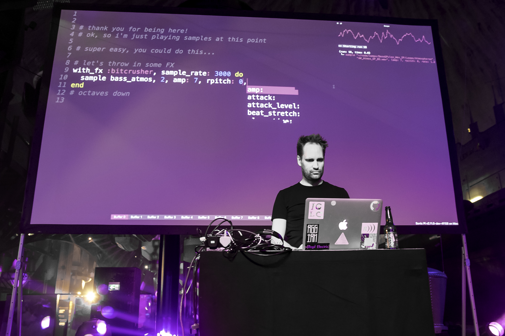

## Music Making >= Computer Programming

_Rob Toulson_
 
 
 
Music notation is probably one of the earliest forms of sequential programming. Each note on a stave informs the performer what action to take and the output is generally reliable and repeatable. Of course one thing that makes music making different from computer programming is the ability to add human expression and interpretation to the performance – adding pseudo-random events and character to the sound that is created. Nowadays computing systems are able to introduce fuzzy logic parameters, and modern processing speeds are sufficient to enable humanised responses to be incorporated. With all this in mind, it’s no surprise that collaborations between computing and musical experts have resulted in wild and wonderful innovations that unlock new forms of musical expression and creativity.

Music programming has increased exponentially with the growth of computers from the 1950s. Early approaches to music programming included Daphne Oram’s Oramics machine, which allowed dark shapes painted on transparent film to be mechanically drawn at a set speed over photocells, blocking light and affecting the parameters of a synthesizer circuit. Pitch, timbre, amplitude and playback speed could all be manipulated and programmed, allowing the same composition to be performed time and time again by the analogue synth.

During the 60s and 70s the first reliable music programming languages appeared, including the first systems to utilise the Fortran high-level programming language in 1967, and moving to the C programming language in the 70s and 80s. Programming languages allowed digital creation and playback of sine waves that could be combined and modulated by algorithms and equations, generating sounds that had never before been heard or used in music composition. In the 1908s the use of MIDI systems, digital samplers, drum machines and polyphonic synthesizers became ubiquitous, shaping a generation of music making and defining a whole new genre of it’s own.

It wasn’t long before computers found their way into the music recording studio, bringing functional benefits above the traditional analogue tape and mixing console approach. With digital audio workstations (DAWs), such as Cuebase and Pro Tools, the 1990s music producer could record sound straight into the computer and also cut, paste and loop sections, resulting in a whole new tool to experiment with. The music studio became an instrument in its own right, enabling musicians to explore innovative creative ideas. But the digital systems just didn’t sound as good as analogue tape and valve processing units. Before long, computers were sufficiently fast and intelligent to perform digital signal processing algorithms that can make digital music sound analogue, but now it was also possible to modify sound in a whole manner of ways: to digitally retune an imperfect recording, to make a singer sound like they are stood in a cathedral, or to make a piano sound like a guitar for example.

More recently, touchscreen interfaces have disrupted the way we make music. Apps on a mobile tablet device can be used on stage and enable novice musicians to experiment easily with software packages for making, for example, drum loops and synthesized sounds. The software language itself has now become a musical instrument too, with the real-time live coding capabilities of Supercollider and Sonic Pi. With live coding, the computer code is the music score and performers write musical code as fluently as a violinist might perform in an orchestra.

Nowadays we not only hack software, but the computer electronics too, incorporating ARM mbeds, Arduinos and Raspberry Pi devices into the DIY music maker’s toolkit. It’s now possible therefore to re-evaluate the importance and connection between computer programming and music making, and it’s no surprise that one another can be used to support education methods in both subjects. In many respects the future for creative music making and computer programming lies in bringing together the virtual and physical worlds in collaboration – imagine robotic drum machines, instruments played by drones and clothing that turns body movement into performance sound. These technologies are with us already, and with the next computing revolution – the Internet of Things – just around the corner, the future for computerised music making still has a lot of innovation and creativity to be realised.

*Image: Dr Sam Aaron, inventor of Sonic Pi, performs live coding for nightclub partygoers*
