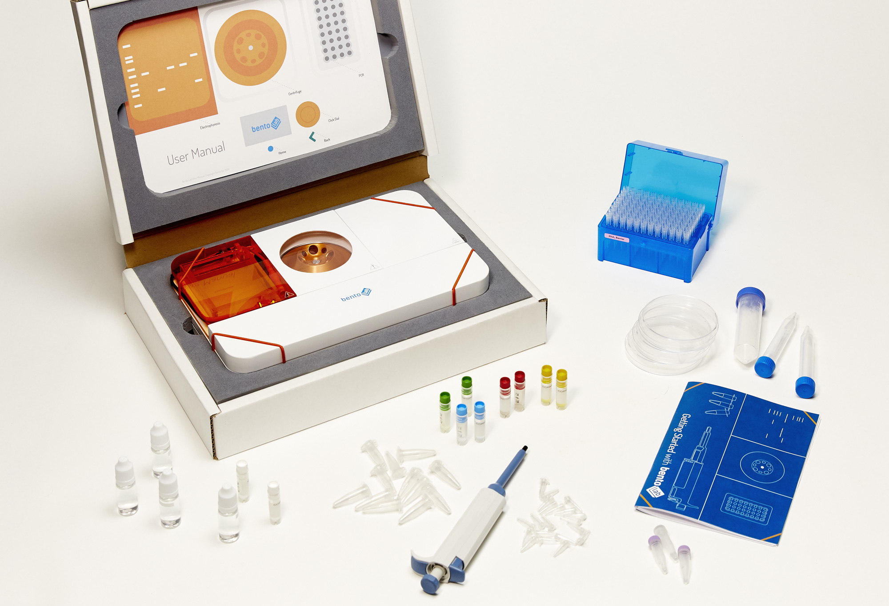

## Shoreditch, 2012

*Philip Boeing*
 
 
 
A group of science enthusiasts, hackers and students from University College London are meeting up on regular evenings to investigate the potentials and limitations of _Biohacking_ - citizen science in Synthetic Biology. Tonight they’re building a bacteria incubator out of a fridge box, cardboard, open source electronics and lots of scotch tape. 

The students are taking part in the annual international Genetically Engineered Machine competition (iGEM), a kind of university student maker-faire for genetic engineering. Each participating group creates, tests and shares _BioBricks_, small pieces of DNA that are meant to have a specific function. For example, one BioBrick might function as a sensor, whilst another one might function as a reporter by producing a fluorescent protein that makes a bacterial cell glow under UV light. BioBricks are formatted in a specific standardised way so they can be easily chained together into a _Genetic Circuit_, with BioBricks of particular functions action together to create desired functionality. In practice, many BioBricks only work in very specific contexts and often lack documentation, but the effort to make engineering biology more standardised and thereby more sharable has undoubtedly lowered the threshold. A handful of undergraduate students are now able to conduct projects that previously might have taken an entire PhD’s worth of lab work.

*Image1: Bento Lab Beta Prototype*

Biohackers are people from many walks of life who have declared the engineering of biology their hobby, and who are trying to replicate the kind of work done by students in the iGEM competition in their own community laboratories. Back in Shoreditch, the UCL students were facilitating through a series of workshops at London Hackspace and UCL’s teaching laboratories the creation of a first Biohacker-made BioBrick, which they named the _Public BioBrick_. For the students, it was a new experience to encounter biotechnology outside of the university walls. 

> I was very surprised to find a group of people who are so motivated and curious about biology that they’re willing to give up their spare time for this project. They’re very dedicated.

said one student.

>Their approach to science leads them to really see each step in its own right.

Since 2012, the London Biohackspace has successfully become the first community laboratory in the United Kingdom with a license to carry out simple bacterial genetic engineering work. Indeed, all over the globe, Biohacking communities are emerging, often within existing Hackerspaces and Fablabs. In the United States, New York’s Genspace and California’s Biocurious and Counter Culture Labs are at the forefront of this movement. They host public workshops, as well as community projects such as _Real Vegan Cheese_, an ongoing attempt to engineer baker’s yeast to synthesise milk protein.

In Amsterdam, the Waag society hosts an open laboratory, workshops and an annual _BioHack Academy_, in which participants learn how to build their own laboratory equipment and put them to use. In Tokyo, bio-media arts collective BCL and maker community Loftworks recently opened _BioClub_, their own open laboratory space, building on the examples of existing communities in the United States and Europe, as well as on temporary hands-on bio-media art workshops.

After facilitating the 2012 Public BioBrick project, Bethan Wolfenden and I proposed a project to compliment the growth of biohacking communities around the globe. We wanted to put together all the most essential tools that would allow any curious person to become a biohacker. In the same way that the maker movement in electronics had been amplified by the Arduino platform, an easy-to-use micro-controller initially developed for artists, we hoped to open up biohacking to a larger and more diverse group of people. At UCL’s then new “Institute of Making”, a dedicated student Makerspace on campus, we spent the next two years building prototypes and putting them to the test at science festivals around the UK. Eventually, this became Bento Lab, a laptop-sized DNA analysis laboratory combining a centrifuge to extract DNA, a _PCR machine_, to copy genes from DNA samples, and a _Gel Electrophoresis_ unit to visualise physical fragments of DNA.

To take our idea further, we built 15 Bento Lab prototypes and sent them to beta-testers all around the world. Some were using Bento Lab in their own citizen science projects, such as _Beer Decoded_, which is mapping the taste of different beers to the genetic diversity of the yeast used to brew it. Some testers used Bento Lab within universities to teach, or took them into the field for on-site research. In Wales, a group of pensioners is using Bento Lab to analyse the DNA of fungi in the environment. They are part of the _Pembrokeshire Fungus Recording Network_ and collaborate with a local university to contribute to the understanding of the local fungi ecosystem.

When we saw that Bento Lab was of tangible use to a wide set of different activities, we decided to turn to Kickstarter to support our first real production-run. On Kickstarter, creators can propose products that will only be be produced if a certain minimum of pre-orders is achieved. We successfully raised over £150,000, which allows us to invest in the necessary design improvements, safety testing and tooling for production. In addition to Bento Lab, we proposed a community platform to facilitate exchange and discussions, and a set of beginner experiments and instructions. This way, we hope that we can take a big step forward towards genetics becoming an open and participatory technology.

Philipp Boeing is one of the co-founders of Bento Lab, an all-in-one DNA laboratory that anyone can use. He studied Computer Science with a focus on Synthetic Biology at University College London. As a member of bio-media-arts group BCL in Tokyo, he explores the relationships between media art, biosciences and society.

*Image2: Bento Lab Kickstarter model with Tutorial Kit*
