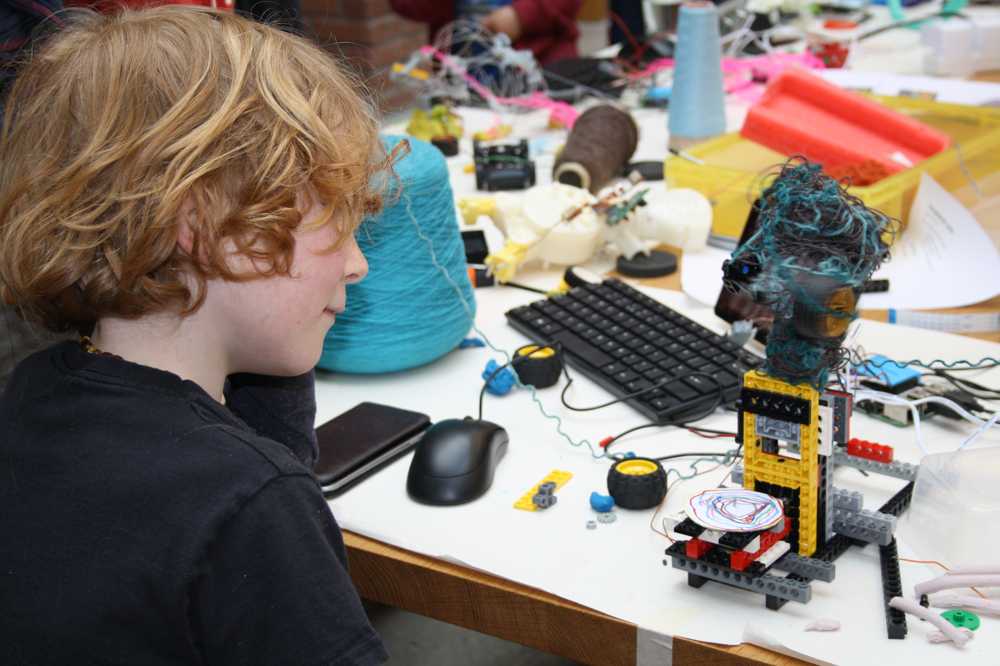

_Image: Tanglebots workshop. Photo: FoAM_

## Tanglebots

_Dave Griffiths (FoAM Kernow) and the Weaving Codes, Coding Weaves team_
 
 
 
In the _weaving codes - coding weaves_ project, Alex McLean, Ellen Harlizius-Klück and I reconnect modern digital tools and the ancient and fundamentally digital art of weaving. We ask for the theoretical points where weaving and computer programming connect and develop codes and code machines to pursue these questions. To control the entanglement of threads is not that demanding for human beings and hands, however it is a challenge for machines and robots. For the finale to the *weaving_codes - coding weaves* (http://kairotic.org) project we are trying a new approach to technology education inspired by this, teaching families about code, robotics and thread by building “tanglebots” (http://fo.am/tanglebots/).

The concept for the tanglebots workshop was to combine programming with physical objects, concentrating on sensor input and movement as output. It’s important that we incorporate our weaving codes research process, so deliberately setting goals we don’t yet know the answers to. From our perspective this gave us an opportunity for us to open up our ideas, and look for new directions and research questions to guide our future work.

The weaving focus allows us to ground the workshop in loom technology and demonstrate the challenges of manipulating thread, with its enormous history of technological development. For the this first workshop, Ellen started us off with an introduction using FoAM Kernow’s Harris loom and the fundamentals of weaving. We were also joined by Janet and Jon from our partner Lovebytes organisation from Sheffield who will run future workshops in and around their part of the country. When first talking about possible workshops with children, we’d discussed the possibility of making a functional loom in a couple of hours with only broken toys and lego. We decided that this workshop would be interesting, but was destined to fail and would end up in a mess of tangled threads and broken technologies. Alex suggested turning these difficulties to an advantage, and making tangles the actual goal of the workshop. In the same spirit created a series of prizes for ‘alternative’ categories such as “Most technical effort with least impressive result” – inspired by Japanese hebocon contests for the “technically ungifted” where “pseudo-robots which don’t even move properly” go head to head. By focussing on error, we planned to create a fun and supportive environment where conceptual insights and engagement with material were privileged over slick end results.

The workshop format we used was also heavily influenced by Paul Granjon’s wrekshops (http://www.zprod.org/zwp/wrekshop/) – wherever possible we reused technology by pulling apart e-waste, making use of electronics, motors, gears and ideas from the surprising complexity of what’s inside the things people throw away. This turned out to have a powerful implicit message about recycling, parents I talked to had tried taking things apart to learn about them, but the next step – making use of the parts discovered as we were doing here, needs a bit more help to do.
FoAM always recognise the importance of food in communal events, in providing both sustenance and inspiration for the goings on. In this case lunch was tangled by Amber Griffiths and Francesca Sargent, forming cardamom knots, spiralised courgette and spaghetti fritters.

The workshop went well, but we noted some things to improve for future workshops. The groups ended up a bit lopsided, so in future we plan to pre-arrange them as we have with previous workshops. In order to do that we need to ask for more information from participants beforehand such as family ages and backgrounds. We tried using the small Pi touchscreens – these were a bit too fiddly to get away without a mouse, but are much less overbearing than larger PC monitors – as they are so small, they became incorporated into the tanglebots themselves. 

We also thought about different approaches to future tanglebots workshops, perhaps starting them with a manual tangling exercise (such as weaving with rope) in order to focus on the threads before getting distracted by the technology. Likewise, Lego has a strange all or nothing effect, once you start using it – everything has to work that way. It would be interesting to try a workshop without, and seeing what different creative options emerge.

All our resources are being uploaded to the kairotic github repository (https://github.com/Kairotic/tanglebots/) to help you run a tanglebots workshop if you wish!

As well as being supported by [AHRC Digital Transformations](http://www.ahrc.ac.uk/research/fundedthemesandprogrammes/themes/digitaltransformations/), this project was part of [British Science Week](https://www.britishscienceweek.org/), supported by the [British Science Association](https://www.britishscienceassociation.org/).

